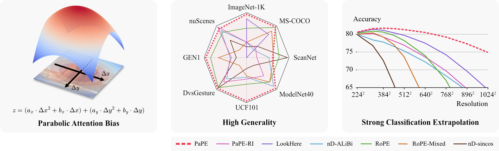

# Where to Attend: A Principled Vision-Centric Position Encoding with Parabolas



This is the official repository for the paper: **Where to Attend: A Principled Vision-Centric Position Encoding with Parabolas**.

See *pape/nn/positions/{pape,pape_ri}.py* if you are mainly interested in the code for PaPE and PaPE-RI. The rest of the code is related to the experiments in the paper.

**Citation**

``` bibtex
@article{ohrstrom2026attend,
  author = {{\O}hrstr{\o}m, Christoffer Koo and Muchacho, Rafael I Cabral and Dong, Yifei and Moumtzidellis, Filippos and G{\"u}ldenring, Ronja and Pokorny, Florian T and Nalpantidis, Lazaros},
  title  = {Where to Attend: A Principled Vision-Centric Position Encoding with Parabolas},
  year   = {2026},
}
```

## Getting Started

You will need [uv](https://docs.astral.sh/uv/), [Rust](https://rust-lang.org/), [Python](https://www.python.org), and [FFmpeg](https://ffmpeg.org/) to install the project.

We expect at least Python v3.12 and recommend installing it through uv.
The project has been tested with rustc v1.90.0 and FFmpeeg 6.1.1.

Run the install script to install the project in a new virtual environment.

``` sh
sh install.sh
```

You should also create these directories at the project root:

``` txt
datasets/
experiments/
```

Datasets must be placed in *datasets* (see [Download and Prepare Datasets](#download-and-prepare-datasets)).
Model checkpoints will automatically be placed in *experiments*.

We further log experiments (hyperparameters and learning curves) to [Weights & Biases](https://wandb.ai) and expect that your user has access to a project called "*parabolic-position-encoding*". Please create this project. You can change this in `pape/constants.py` if you want a different project name.

## Training

All datasets use the same entrypoint: *train.py*.

For example, you can train an ImageNet1K model like this:

``` sh
uv run train.py imagenet --positional pape
```

This will create a new experiment with a random name. Use the `--name` flag to give the experiment a custom name. You will refer to this name later when evaluating the model.

``` sh
uv run train.py imagenet --positional pape --name ImageNet1K-PaPE
```

You can add the `--debug` flag to avoid saving checkpoints and turn off logging to Weights & Biases.

``` sh
uv run train.py imagenet --positional pape --debug
```

Use the `--help` flag to see all options and their defaults.

``` sh
uv run train.py imagenet --help
```

## Evaluation

Use *evaluate.py* to evaluate a model:

``` sh
uv run evaluate.py [name]
```

`[name]` refers to the name assigned in training.
The results are logged to Weights & Biases.

Evaluation defaults to use the validation split and the checkpoint that obtained the highest validation score during training. Use the `--split` and `--checkpoint` options to change this:

``` sh
uv run evaluate.py [name] --split test --checkpoint last
```

## Download and Prepare Datasets

Dataset-specific instructions follow below. Generally, the datasets shall be placed in a *datasets* directory at the root of the project, like this:

Datasets:
``` txt
datasets/
    - coco/
    - dvs_gesture/
    - gen1/
    - imagenet/
    - ucf_101/
```

### COCO
Download the COCO 2017 version from the official source, like this:

``` sh
mkdir datasets/coco
cd datasets/coco
wget http://images.cocodataset.org/annotations/annotations_trainval2017.zip
wget http://images.cocodataset.org/annotations/image_info_test2017.zip
wget http://images.cocodataset.org/zips/train2017.zip
wget http://images.cocodataset.org/zips/val2017.zip
wget http://images.cocodataset.org/zips/test2017.zip
```

The contents should look like this after unzipping:

``` txt
datasets/
    - coco/
        - annotations/
        - test2017/
        - train2017/
        - val2017/
```

### DvsGesture

Download the dataset [here](https://ibm.ent.box.com/s/3hiq58ww1pbbjrinh367ykfdf60xsfm8/folder/50167556794).

The contents should look like this after unpacking:

``` txt
datasets/
    - dvs_gesture/
        - DvsGesture/
```

Preprocess the dataset:

``` sh
uv run preprocess.py dvsgesture
```

The preprocessed dataset is stored in *datasets/dvs_gesture-preprocessed/*.

### GEN1

Download the dataset [here](https://www.prophesee.ai/2020/01/24/prophesee-gen1-automotive-detection-dataset/).

The contents should look like this after unpacking:

``` txt
datasets/
    - gen1/
        - test/
        - train/
        - val/
```

Preprocess the dataset:

``` sh
uv run preprocess.py gen1
```

The preprocessed dataset is stored in *datasets/gen1-preprocessed/*.

### ImageNet

We use ImageNet1K.

Follow [this guide](https://towardsdatascience.com/downloading-and-using-the-imagenet-dataset-with-pytorch-f0908437c4be/) to download it from Kaggle.

The contents should look like this afterwards:

``` txt
datasets/
    - imagenet/
        - ILSVRC/
        - ILSVRC2012_val_labels.json
        - imagenet_class_index.json
        - LOC_sample_submission.csv
        - LOC_synset_mapping.txt
        - LOC_train_solution.csv
        - LOC_val_solution.csv
```

### UCF101

Download UCF-101 from [here](https://www.crcv.ucf.edu/research/data-sets/ucf101/). Download the dataset itself and the *action recognition* annotations. The downloads should be unpacked inside of *datasets/ucf_101*, such that it looks like this:

``` txt
datasets/
    - ucf_101/
        - UCF-101/
        - ucfTrainTestlist
```


## Acknowledgements

This repository uses code from the following projects:

* [Prophesee toolbox](https://github.com/prophesee-ai/prophesee-automotive-dataset-toolbox): For loading data from Prophesee datasets (GEN1).
* [Ultralytics](https://github.com/ultralytics/ultralytics): For the YOLOv10 object detection head.
* [Spiking Patches](https://github.com/DTU-PAS/spiking-patches): For tokenization of events from event cameras.
* [LookHere](https://github.com/GreenCUBIC/lookhere/tree/main): LookHere implementation.